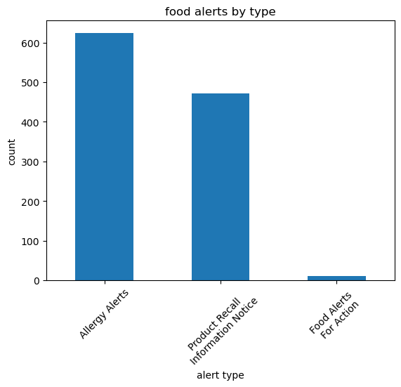
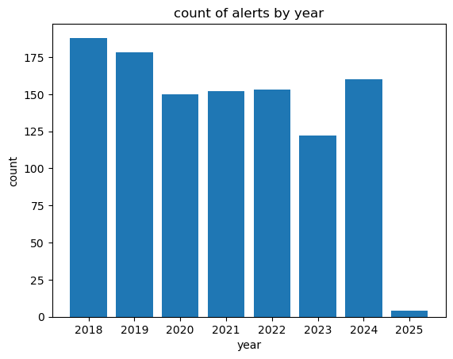
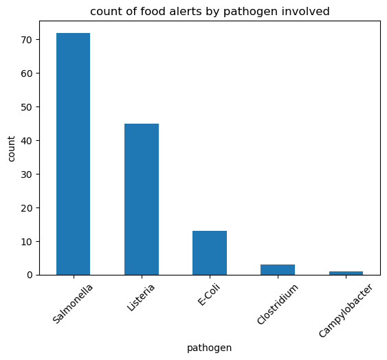
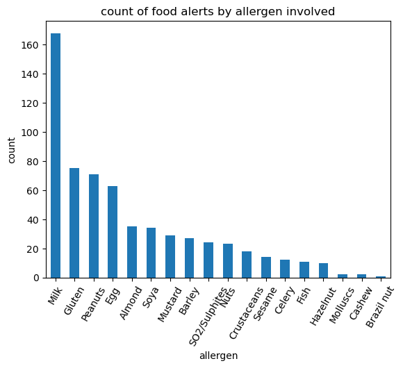
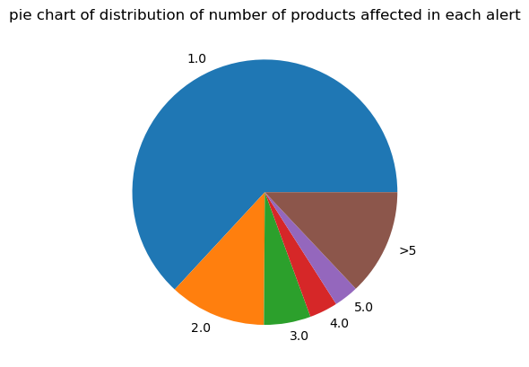

# Food Alerts Report
Analysis of data from Food Standards Agency's food alerts API including data from 18th Jan 2018 - 15th Jan 2025. This analysis makes use of SQLite, Python, Pandas and Jupyter Notebooks.

## Introduction
This report provides an analysis of the data provided by the Food Standards Agency in their food alerts Application Programming Interface (API). The Food Standards Agency is the body in the UK responsible for food safety and hygiene in Great Britain and Northern Ireland. This API gives a full breakdown of the information provided in each alert, however a significant amount of the data is more quantitative so is suitable for further analysis in python. The standard API provides information for the past 7 years, which provides a sufficient window to gain a good understanding about the broad patterns of alerts present.

The 3 main types of alerts are allergy alerts are:
* Allergy Alerts (AA) - alerts relating to allergies
* Product Recall Information Notices (PRINs) - alerts relating to products being recalled, not including related to allergies
* Food Alerts For Action (FAFA) - alerts which require action from the authorities

## Process
The features for analysis were selected including:
* type of alert
* date of alert
* reporting business
* pathogen involved (if present)
* allergen involved (if present)
* risk statement
* number of products affected
* whether the alert is published or withdrawn

SQLite was then used to create a table of ```food alerts``` so that entries can be added using another script. Adding the table was performed by the ```create_table.py``` python script. SQLite has the advantage of being a lightweight and highly performant database which is considered the first choice when working with a database which only needs to be accessed locally.

Entries to the SQLite database were added using the ```get_from_api.py``` script. The API is accessed by calling 100 alerts at a time, and then offsetting the results by multiples of 100 to ensure that each alert is only included in the table once. The API is returns a .json file so individual features can be accessed easily.

## Analysis
The full process of the analysis is shown in the ```results.ipynb``` notebook.

The first part of the analysis involved using pandas to query the database. This is a very straightforward query as we want all of the data present. A visual inspection shows that the data are consistent with what we would expect.

This analysis makes use of the ```value_counts()``` method for a lot of the visualizations. For the date values a conversion was performed to allow fast and efficient access to the year and month.

As the data was mostly in a form determined by the script to retrieve information from the API, only a minimal amount of cleaning was required.

## Insights
The main insights found from this analysis were:

* Allergy Alerts were the most common alerts (624 instances), followed closely by Product Recall Information Notices (472 instances). Food Alerts For Action were very rare with only 11 being recorded in total.


* There has been a downward trend in the number of alerts per year since 2018, except for 2024 where there were an increase in the number of alerts relative to 2023.

* Tesco was the business that reported the most food alerts (51 instances).


* Salmonella was the most common pathogen associated with food alerts, followed by Listeria and E-Coli.


* The most common allergen in food alerts was milk (168 instances).


* Most alerts afffected only one product, however there was a very uneven distribution. The mean number of products affected was 6.5 and maximum recorded was 190.

* There were no alerts found to have been withdrawn.